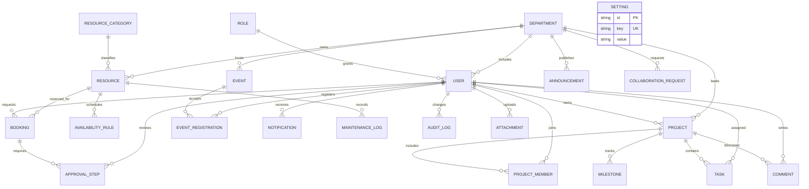

# UniSync ER diagram

```mermaid
erDiagram
  ROLE ||--o{ USER : grants
  DEPARTMENT ||--o{ USER : includes
  USER ||--o{ BOOKING : requests
  RESOURCE_CATEGORY ||--o{ RESOURCE : classifies
  DEPARTMENT ||--o{ RESOURCE : owns
  RESOURCE ||--o{ AVAILABILITY_RULE : schedules
  RESOURCE ||--o{ BOOKING : reserved_for
  BOOKING ||--o{ APPROVAL_STEP : requires
  USER ||--o{ APPROVAL_STEP : reviews
  USER ||--o{ PROJECT : owns
  DEPARTMENT ||--o{ PROJECT : leads
  PROJECT ||--o{ PROJECT_MEMBER : includes
  USER ||--o{ PROJECT_MEMBER : joins
  PROJECT ||--o{ MILESTONE : tracks
  PROJECT ||--o{ TASK : contains
  USER ||--o{ TASK : assigned
  DEPARTMENT ||--o{ EVENT : hosts
  EVENT ||--o{ EVENT_REGISTRATION : accepts
  USER ||--o{ EVENT_REGISTRATION : registers
  PROJECT ||--o{ COMMENT : discusses
  USER ||--o{ COMMENT : writes
  USER ||--o{ NOTIFICATION : receives
  RESOURCE ||--o{ MAINTENANCE_LOG : records
  USER ||--o{ AUDIT_LOG : changes
  DEPARTMENT ||--o{ ANNOUNCEMENT : publishes
  DEPARTMENT ||--o{ COLLABORATION_REQUEST : requests
  USER ||--o{ ATTACHMENT : uploads
  SETTING {
    string id PK
    string key UK
    string value
  }
```
